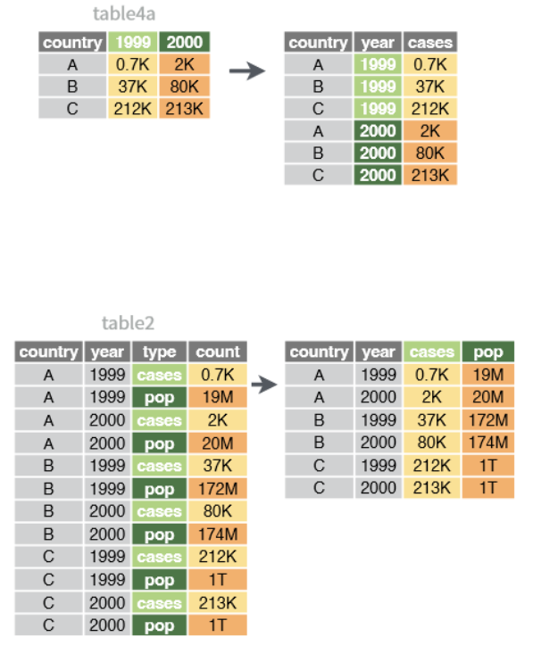
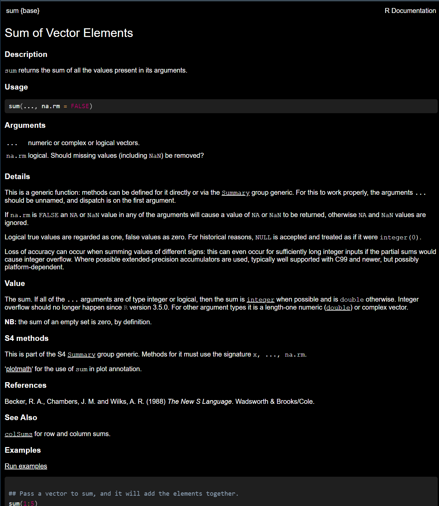
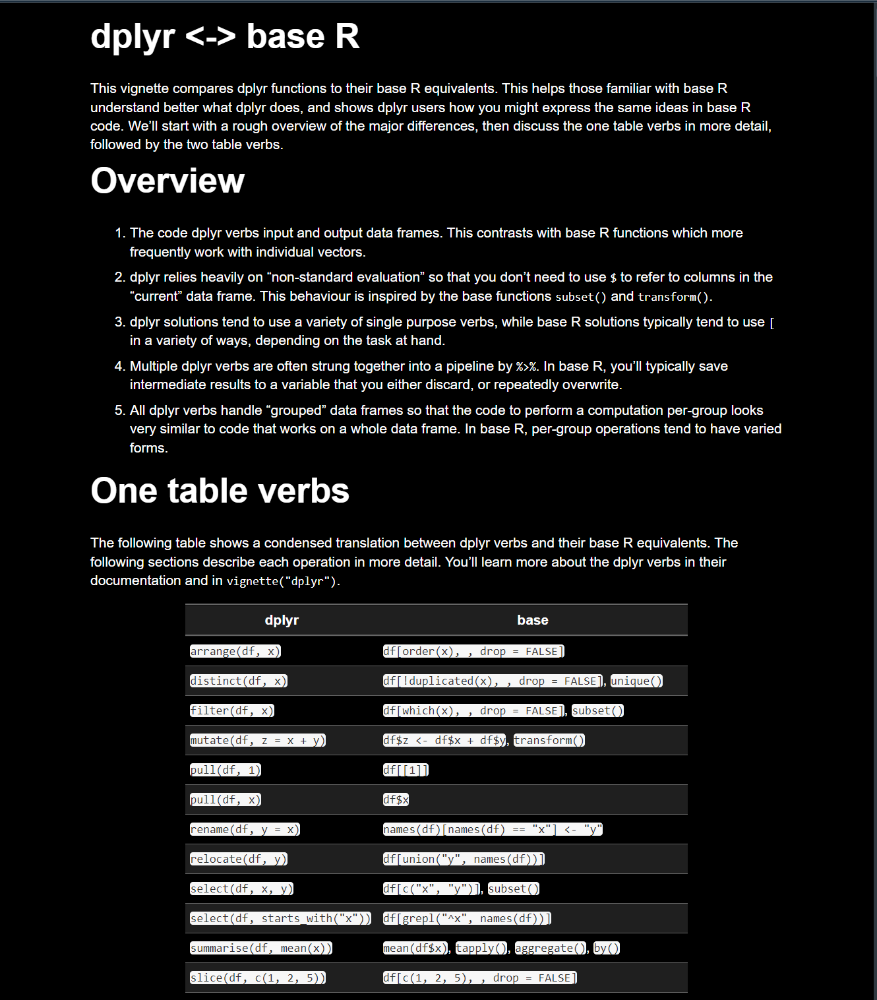
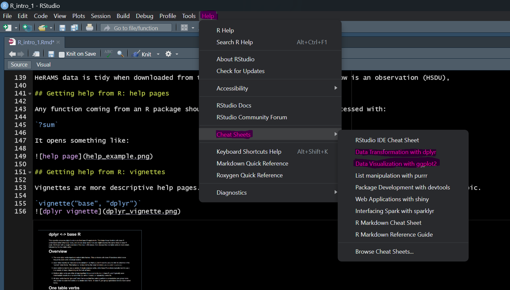

```{css, echo=FALSE}
slides > slide {
  font-size: 18px; /* Adjust the font size as needed */
}
```

```{r setup, include=FALSE}
knitr::opts_chunk$set(echo = FALSE)

library(tidyverse)
```

## Introduction to R

- What is R?
- Why use R?

## What is R?

- **R is a programming language** designed for statistical computing and graphics.
- Developed by Ross Ihaka and Robert Gentleman in the early 1990s at the University of Auckland, New Zealand.
- **Open Source**: Free to use, share, and modify
- **Comprehensive**: Offers a vast collection of techniques
- **Extensible**: Users can easily write their own packages and distribute them
- **Interactive**: Allows for immediate feedback and facilitates exploratory data analysis.
- **Reproducible**: scripts can be written for reproducible research and automation of complex analyses.
- **Integration**: Works well with data from various sources and can be integrated with other languages (e.g., C, C++, Java, Python) and tools (e.g., databases, GIS).

## Why Use R? Comparing R to Python

| Feature                        | R                                                              | Python                                                         |
|--------------------------------|----------------------------------------------------------------|----------------------------------------------------------------|
| **Focus**                      | Designed specifically for statistical analysis and visualization. | General-purpose programming with strong support for data science. |
| **Ecosystem**                  | Over 16,000 packages on CRAN for various statistical needs.    | Rich library ecosystem with a strong focus on both data science and general programming. |
| **Data Visualization**         | `ggplot2` offers superior aesthetics and functionality.        | `matplotlib` and `seaborn` for powerful visualizations, with a learning curve. |
| **IDE**                        | RStudio: A powerful, dedicated IDE for R.                      | Various (e.g., PyCharm, Jupyter Notebooks, VS Code), versatile but not specialized. |
| **Community and Support**      | Deeply rooted in academia and research, with extensive resources for statistical problems. | Broad, with a strong emphasis on general programming and software development. |
| **Ease of Learning**           | Syntax and data structures designed with statisticians in mind, potentially more intuitive for those with a statistical background. | Praised for readability and simplicity, appealing to a wide range of backgrounds. |
| **Performance**                | Highly efficient for data analysis tasks, with packages designed for speed. | Might have an edge in performance for general programming tasks, due to optimized libraries like NumPy. |

- **Conclusion**: The choice between R and Python often depends on the needs of the project, and ultimately the programmers. Data scientist tend to prefer R, whilst data engineers Python.


## Basic Data Types in R

- **Numeric**: Represents decimal values and integers. Example: `x <- 2.5`, `y <- 10`

- **Integer**: A subtype of numeric that represents whole numbers. Integers are specified by adding `L` to the end of a number (or just `25`). Example: `count <- 25L`

- **Character**: Represents strings (text). Example: `name <- "John Doe"`

- **Factor**: Used for categorical data. Levels provide a way to handle categorical variables. Example: `gender <- factor(c("male", "female", "female"))`

```{r factor-example, echo=TRUE}
gender <- factor(c("male", "female", "female"))

print(gender)

```


- **Logical**: Holds Boolean (TRUE or FALSE), logical, values. Example: `is_valid <- TRUE`

## Collections of data

- **List**: An ordered collection that can contain objects of different types, including numbers, strings, vectors, and even other lists. Example:

```{r list-example, echo=TRUE}
my_list <- list(name="Alice", age=25, scores=c(90, 80, 85))
```

- **Data Frame**: A collection of vectors of equal length, but potentially different types. It's the most common data structure for datasets. Example:

```{r data-frame-example, echo=TRUE}
df <- data.frame(
  Name = c("Alice", "Bob", "Charlie"),
  Age = c(25, 32, 28),
  Gender = factor(c("Female", "Male", "Male"))
)
```

- **Matrix**: similar to data frames but with only one type of data (e.g. only numerical)


## R and RStudio

Simply put, R is the engine and RStudio is the dashboard:


Source: [Statistical Inference via Data Science, Modern Dive](https://moderndive.com/index.html)

## R packages

Out of the box R is called "base R". However, it can be limited in its functionalities, and its use a bit confusing to modern users.

Then come packages. They supplement base R, and can be so useful that the first thing you would typically do is to load one.

Excellent sources of packages include the (tidyverse)[https://www.tidyverse.org/] (see below) and (ROpenSci)[https://ropensci.org/].

Packages are installed with:

```{r install-package-example, echo=TRUE}
install.packages("tidyverse")
```

The package are then loaded for use with the R environement with (note the absence of quotation):
```{r load-package-example, echo=TRUE}
library(tidyverse)
```

## The tidyverse

Reigning supreme over all packages are the (tidyverse)[https://www.tidyverse.org/] packages.

They are a collection of packages that offer a similar approach to data. They are well maintained and documented which make them excellent choices:

- **tidyr**: helps to create tidy data: pivot, fill, split, etc.

- **dplyr**: data manipulation: summarise, group, filter, select, slice, join, etc.

- **readr**: read data

- **ggplot2**: plotting data

- **stringr**: string manipulation

- **forcats**: factors manipulation

- **purrr**: functional programming

## Tidy data

Core to the tidyverse is the concept of tidy data.

Tidy data is data where:

- Each variable is a column; each column is a variable.

- Each observation is a row; each row is an observation.

- Each value is a cell; each cell is a single value.


HeRAMS data is tidy when downloaded from the plateform: each variable (each row is an observation (HSDU), 

## Getting help from R: help pages

Any function coming from an R package should have an help page that can be accessed with:

`?sum`

It opens something like:



## Getting help from R: vignettes

Vignettes are more descriptive help pages. They are written by the package creator to examplify a specific topic.

`vignette("base", "dplyr")`

## Getting help from R: cheatsheet

Cheatsheets are available for most tidyverse packages directly from RStudio:



## Go further

- [datacamp](https://www.datacamp.com/): good starting point for learning

- [RStudio's beggininers education](https://education.rstudio.com/learn/beginner/)

- Large language models (chatGPT & co.) can be great coding tutors!